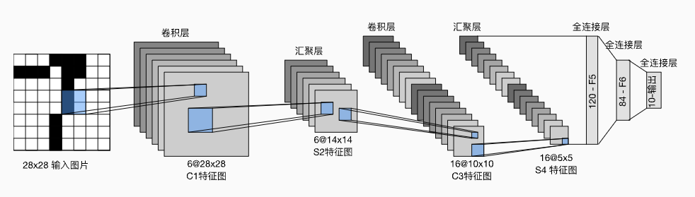
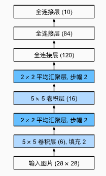

# 模型简介

- [LeNet](https://ieeexplore.ieee.org/abstract/document/726791/) 是最早发布的卷积神经网络之一，由 Yann LeCun 在1998年提出，目的是识别图像中的手写数字。当时，LeNet取得了与 SVM 相媲美的成果，成为监督学习的主流方法。LeNet 被广泛用于自动取款机机中，帮助识别处理支票的数字


# 模型结构

- 模型架构图

  

  

  整体可以分成两个部分

  1. 卷积编码器：由两个卷积层组成

     > 每个卷积块中的基本单元是一个卷积层、一个sigmoid激活函数和平均汇聚层
     >
     > 虽然 ReLU 和最大汇聚层更有效，但它们在20世纪90年代还没有出现

  2. 全连接层密集块：由三个全连接层组成

     > 为了将卷积块的输出传递给稠密块，我们必须在小批量中展平每个样本
     >
     > 最后一个全连接层的输出尺寸和类别数量相等，便于之后计算分类问题的交叉熵损失

- 模型定义

  ```python
  import torch
  from torch import nn
  
  net = nn.Sequential(
      nn.Conv2d(1, 6, kernel_size=5, padding=2), nn.Sigmoid(),
      nn.AvgPool2d(kernel_size=2, stride=2),
      nn.Conv2d(6, 16, kernel_size=5), nn.Sigmoid(),
      nn.AvgPool2d(kernel_size=2, stride=2),
      nn.Flatten(),
      nn.Linear(16 * 5 * 5, 120), nn.Sigmoid(),
      nn.Linear(120, 84), nn.Sigmoid(),
      nn.Linear(84, 10))
  ```

  中间层尺寸

  ```python
  X = torch.rand(size=(1, 1, 28, 28), dtype=torch.float32)
  for layer in net:
      X = layer(X)
      print(layer.__class__.__name__,'output shape: \t',X.shape)
  ```
  
  ```
  Conv2d output shape:         torch.Size([1, 6, 28, 28])
  Sigmoid output shape:        torch.Size([1, 6, 28, 28])
  AvgPool2d output shape:      torch.Size([1, 6, 14, 14])
  Conv2d output shape:         torch.Size([1, 16, 10, 10])
  Sigmoid output shape:        torch.Size([1, 16, 10, 10])
  AvgPool2d output shape:      torch.Size([1, 16, 5, 5])
  Flatten output shape:        torch.Size([1, 400])
  Linear output shape:         torch.Size([1, 120])
  Sigmoid output shape:        torch.Size([1, 120])
  Linear output shape:         torch.Size([1, 84])
  Sigmoid output shape:        torch.Size([1, 84])
  Linear output shape:         torch.Size([1, 10])
  ```
  
  > 卷积层/汇聚层输出尺寸计算公式：设原始输入尺寸为 $(n_h, n_w)$，卷积核尺寸 $(k_h,k_w)$，padding尺寸为 $(p_h,p_w)$，步幅尺寸 $(s_h, s_w)$，卷积输出尺寸为
  > $$
  > \left\lfloor\left(n_{h}-k_{h}+p_{h}+s_{h}\right) / s_{h}\right\rfloor \times\left\lfloor\left(n_{w}-k_{w}+p_{w}+s_{w}\right) / s_{w}\right\rfloor .
  > $$
  > 验证计算代码
  >
  > ```python
  > def get_output_size(input_size, kernel_size, padding_size, slide_size):
  >     output_size_h = int((input_size[0]-kernel_size[0] + padding_size[0] + slide_size[0])/slide_size[0])
  >     output_size_w = int((input_size[1]-kernel_size[1] + padding_size[1] + slide_size[1])/slide_size[1])
  >     return (output_size_h, output_size_w)
  > 
  > # 第一个5x5卷积的输出尺寸
  > output_size = get_output_size(
  >     input_size = (28, 28),
  >     kernel_size = (5, 5), 
  >     padding_size = (2*2, 2*2),
  >     slide_size = (1,1)
  > )
  > print(output_size)  # (28, 28)
  > 
  > # 第一个2x2平均汇聚层的输出尺寸
  > output_size = get_output_size(
  >     input_size = (28, 28),
  >     kernel_size = (2, 2), 
  >     padding_size = (0, 0),
  >     slide_size = (2,2)
  > )
  > print(output_size)  # (14, 14)
  > ```

