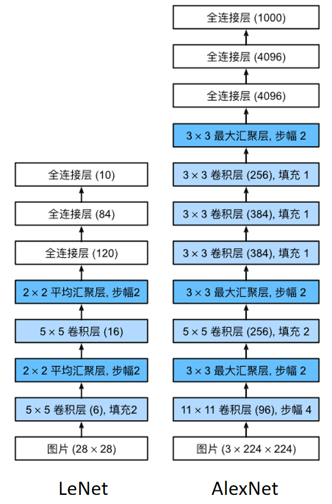

# 模型简介

- 虽然 1998 年的 LeNet 开创了使用 CNN 这种端到端系统处理计算机视觉任务的先河，但是它并没有直接主导这些领域。由于**数据和算力限制**，在上世纪 90 年代初到 2012 年之间的大部分时间里，神经网络往往被 SVM 等经典机器学习方法超越

  > - 从第一性原理出发，机器学习的根本目的是建立从输入到输出的映射关系，端到端的观点就是
  >   $$
  >   输入 \xrightarrow{模型} 输出
  >   $$
  >   **经典机器学习方法大多基于统计学习理论和信息论，其中涉及到很多数学优化方法，这些方法往往对数据维度敏感**，难以处理高维或具有结构化特征的输入。为了解决这个问题，早期研究引入了独立的特征提取阶段，即
  >   $$
  >   输入 \xrightarrow{手工设计/特征函数} 特征 \xrightarrow{模型} 输出
  >   $$
  >   手工设计的特征引入了人类先验信息，有效**控制特征空间维度的同时引入了一定的特征泛化性**，这允许我们在有限的特征空间中建立复杂度和假设空间都较低的经典机器学习模型，并保持较高的泛化性能
  >
  > - 总结一下经典机器学习方法和深度学习方法的区别
  >   1. **`经典机器学习方法`**模型复杂度较低，需要引入人类先验的独立的特征提取方法配合处理复杂数据，通常使用基于凸优化的优化方法，在数据量和算力有限的情况下可以实现更好的泛化性能。这时深度学习方法受算力限制难以迭代训练，受数据限制容易过拟合。
  >   2. **`深度学习方法`**模型复杂度高，神经网络本身就是一个特征提取器，端到端的训练过程中同时完成特征提取和分类/回归头映射关系的学习，通常使用迭代的随机梯度下降方法进行训练。**在数据量和算力充足的情况下，深度网络往往能学到比人为先验更好的特征和映射关系**，进而实现更佳的泛化性能。深度学习中，人类先验一般体现在模型的归纳偏置上

- 2009 年 ImageNet 数据集的发布彻底消除了 CV 领域的数据稀缺问题，同时 GPU 的快速发展解决了算力问题，在此基础上，2012年问世的 AlexNet 在 ImageNet 图像识别挑战赛上取得了巨大的成功，首次证明了学习到的特征可以超越手工设计的特征


# 模型结构

- AlexNet 和 LeNet 的架构很相似，如下图所示

  

- AlexNet 和 LeNet 的主要区别为

  1. **使用了更多卷积层**：在数据量充足时，更深的网络有助于提取更好的特征

  2. **使用最大汇聚层而非平均汇聚层**： 最大汇聚操作有利于保留显著特征，且能增强模型的平移不变性，使模型更具鲁棒性。虽然最大汇聚得到的特性没有平均汇聚平滑，但它在大量实践中表现更好

  3. **使用 ReLU 而非 sigmoid激活函数**： ReLU 激活函数的梯度计算更简单且对于模型参数初始化更具鲁棒性

     > 当 sigmoid 激活函数的输出非常接近于 0 或 1 时，这些区域的梯度几乎为0，因此反向传播无法继续更新一些模型参数。 相反，ReLU 激活函数在正区间的梯度总是 1。 因此，如果模型参数没有正确初始化，sigmoid 函数可能在正区间内得到几乎为 0 的梯度，从而使模型无法得到有效的训练

  4. **更大的卷积窗口和输出层**：由于 ImageNet 中大多数图像的宽和高比 MNIST 图像大 10 倍以上，需要更大的卷积窗口来捕获目标；由于 ImageNet 的目标类别为 1000，最终输出的全连接层增大为 1000

  5. **正则化**：AlexNet 使用 dropout 技巧控制全连接层的模型复杂度，从而避免过拟合

  6. **数据增强**：AlexNet 在训练时通过翻转、裁切和变色等操作进行了数据增广，使得模型更健壮，有效地减少了过拟合

- 模型定义

  ```python
  import torch
  from torch import nn
  
  net = nn.Sequential(
      # 使用 11*11 的更大窗口来捕捉对象，使用步幅4来减少输出的高度和宽度
      # 另外，输出通道数远大于 LeNet
      nn.Conv2d(1, 96, kernel_size=11, stride=4, padding=1), nn.ReLU(),
      nn.MaxPool2d(kernel_size=3, stride=2),
      
      # 减小卷积窗口，使用填充为2来使得输入与输出的高和宽一致，进一步增大输出通道数
      nn.Conv2d(96, 256, kernel_size=5, padding=2), nn.ReLU(),
      nn.MaxPool2d(kernel_size=3, stride=2),
      
      # 使用三个连续的卷积层和较小的卷积窗口，中间的通道数量进一步增加
      # 在前两个卷积层之后，汇聚层不用于减少输入的高度和宽度
      nn.Conv2d(256, 384, kernel_size=3, padding=1), nn.ReLU(),
      nn.Conv2d(384, 384, kernel_size=3, padding=1), nn.ReLU(),
      nn.Conv2d(384, 256, kernel_size=3, padding=1), nn.ReLU(),
      nn.MaxPool2d(kernel_size=3, stride=2),
      nn.Flatten(),
      
      # 这里，全连接层的输出数量是LeNet中的好几倍。使用dropout层来减轻过拟合
      nn.Linear(6400, 4096), nn.ReLU(),
      nn.Dropout(p=0.5),
      nn.Linear(4096, 4096), nn.ReLU(),
      nn.Dropout(p=0.5),
      
      # 最后是输出层。由于这里使用Fashion-MNIST，所以用类别数为10，而非论文中的1000
      nn.Linear(4096, 10))
  ```

  中间层尺寸

  ```python
  X = torch.randn(1, 1, 224, 224)
  for layer in net:
      X=layer(X)
      print(layer.__class__.__name__,'output shape:\t',X.shape)
      
  '''
  Conv2d output shape:	 torch.Size([1, 96, 54, 54])
  ReLU output shape:	     torch.Size([1, 96, 54, 54])
  MaxPool2d output shape:	 torch.Size([1, 96, 26, 26])
  Conv2d output shape:	 torch.Size([1, 256, 26, 26])
  ReLU output shape:	 	 torch.Size([1, 256, 26, 26])
  MaxPool2d output shape:	 torch.Size([1, 256, 12, 12])
  Conv2d output shape:	 torch.Size([1, 384, 12, 12])
  ReLU output shape:	     torch.Size([1, 384, 12, 12])
  Conv2d output shape:	 torch.Size([1, 384, 12, 12])
  ReLU output shape:	     torch.Size([1, 384, 12, 12])
  Conv2d output shape:	 torch.Size([1, 256, 12, 12])
  ReLU output shape:	     torch.Size([1, 256, 12, 12])
  MaxPool2d output shape:	 torch.Size([1, 256, 5, 5])
  Flatten output shape:	 torch.Size([1, 6400])
  Linear output shape:	 torch.Size([1, 4096])
  ReLU output shape:	     torch.Size([1, 4096])
  Dropout output shape:	 torch.Size([1, 4096])
  Linear output shape:	 torch.Size([1, 4096])
  ReLU output shape:	     torch.Size([1, 4096])
  Dropout output shape:	 torch.Size([1, 4096])
  Linear output shape:	 torch.Size([1, 10])
  '''
  ```

  卷积层/汇聚层输出尺寸计算公式：设原始输入尺寸为 $(n_h, n_w)$，卷积核尺寸 $(k_h,k_w)$，padding尺寸为 $(p_h,p_w)$，步幅尺寸 $(s_h, s_w)$，输出尺寸为 $\left\lfloor\left(n_{h}-k_{h}+p_{h}+s_{h}\right) / s_{h}\right\rfloor \times\left\lfloor\left(n_{w}-k_{w}+p_{w}+s_{w}\right) / s_{w}\right\rfloor$，验证计算代码

  ```python
  def get_output_size(input_size, kernel_size, padding_size, slide_size):
      output_size_h = int((input_size[0]-kernel_size[0] + padding_size[0] + slide_size[0])/slide_size[0])
      output_size_w = int((input_size[1]-kernel_size[1] + padding_size[1] + slide_size[1])/slide_size[1])
      return (output_size_h, output_size_w)
  
  # 第一个11x11卷积的输出尺寸
  output_size = get_output_size(
      input_size = (224, 224),
      kernel_size = (11, 11), 
      padding_size = (1*2, 1*2),
      slide_size = (4,4)
  )
  print(output_size)  # (54, 54)
  
  # 第一个3x3最大汇聚层的输出尺寸
  output_size = get_output_size(
      input_size = (54, 54),
      kernel_size = (3, 3), 
      padding_size = (0, 0),
      slide_size = (2, 2)
  )
  print(output_size)  # (26, 26)
  ```

  